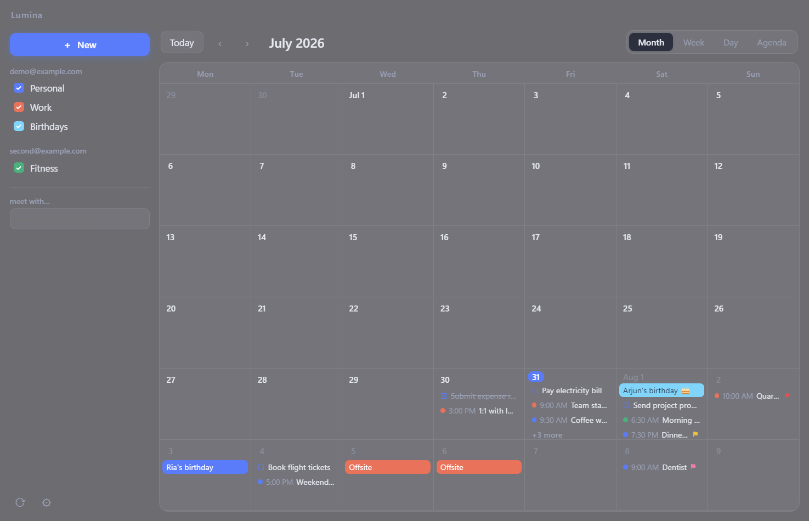
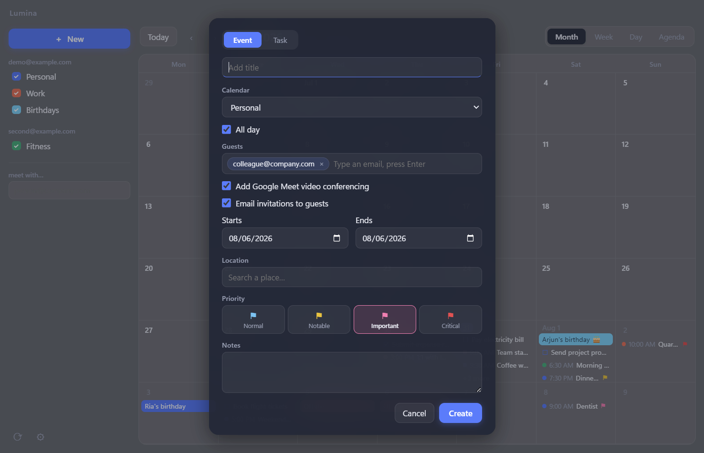
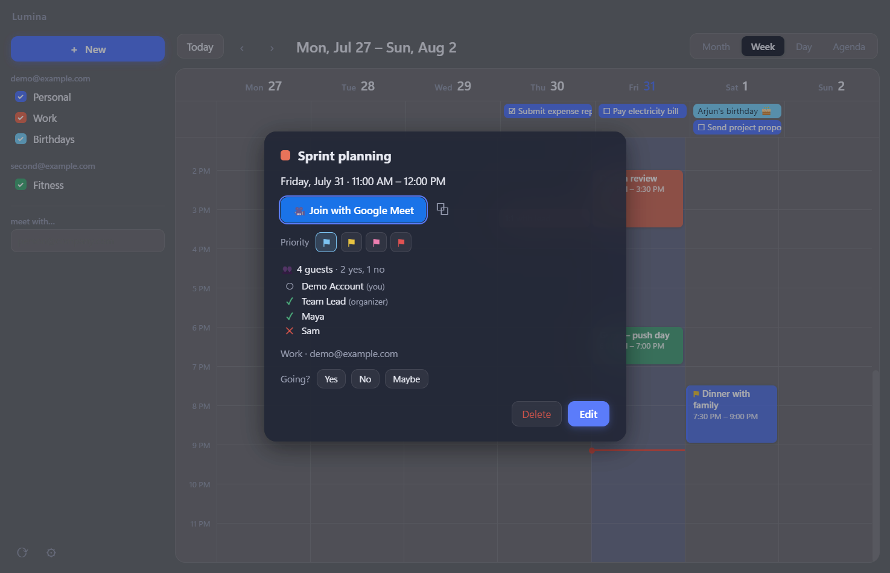
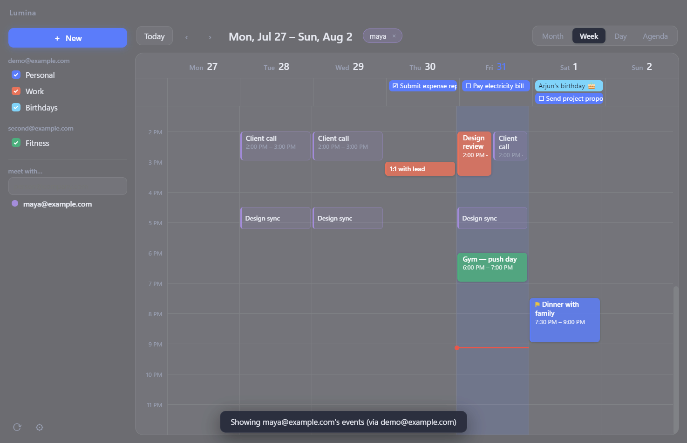
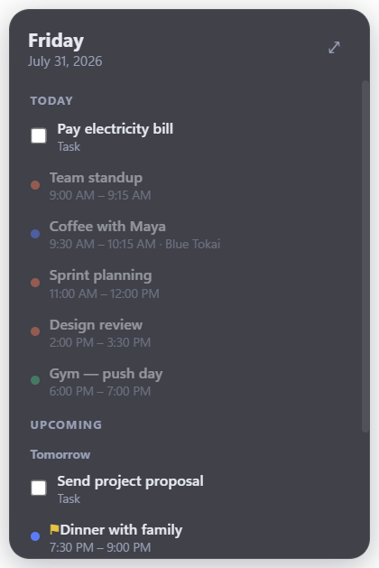

<div align="center">

# Lumina Calendar

**A minimal, translucent desktop calendar for Windows with multi-account Google Calendar and Google Tasks support, priority-driven desktop widgets, and coworker schedule overlays.**



</div>

---

## Features

### 📅 All your Google calendars in one place
- Sign in with **multiple Google accounts** and see every calendar together in one view.
- Check or uncheck any calendar in the sidebar to show or hide it instantly.
- Month, Week, Day, and Agenda views with Windows 11 acrylic transparency, following your light or dark theme.
- Instant navigation: events are cached in month buckets, so flipping between months and views feels immediate.
- Auto-refreshes every 5 minutes, with manual refresh a click away.

### ✏️ Create events and tasks the Google way
- Click any day or time slot to create an event or task, prefilled with that date and time.
- Invite **guests** (with autocomplete from people you already meet), attach a **Google Meet** link automatically, and email invitations, all from the create dialog.
- Location search with live place suggestions; saved locations open directly in **Google Maps**.
- Full **Google Tasks** integration: create tasks with due dates, check them off anywhere they appear.



### 🔍 Rich event details with RSVP
- See the Google Meet link, location, description, and the full guest list with everyone's response status.
- Answer **Going? Yes / No / Maybe** right from the event card.
- Repeating events get proper scope choices: delete *just this event*, *this and following events*, or *the whole series*.



### 🚩 Priority levels that drive your widget
Mark any event on a scale of 4, each with its own colored flag:

| Level | Flag | Appears in the widget |
|---|---|---|
| 1 Normal | 🔵 light blue | on the day of the event |
| 2 Notable | 🟡 yellow | 1 day ahead |
| 3 Important | 🩷 pink | 1 week ahead |
| 4 Critical | 🔴 red | 1 month ahead |

- Set priority per event, or set a **default for an entire calendar** (every event inherits it unless overridden).
- Priorities are stored on the Google event itself, so they sync across your devices.
- Works on repeating events with per-instance or whole-series scope.

### 👥 Meet with: see a coworker's schedule
- Type a coworker's email and their **actual events overlay your calendar** in month, week, and day views, through whichever of your accounts has viewing access to their calendar.
- If they only share free/busy, you get busy blocks instead.
- One click on any of their events shows its details, with an **Add to my calendar** button to copy it over.
- Pin frequent contacts to the sidebar with custom display names, and dismiss overlays from the toolbar pills.



### 🖥️ Desktop widget
- A frosted, frameless card that lives **on your desktop, always below other windows**. It never covers your apps.
- Shows today's agenda plus upcoming events based on their priority, with live task checkboxes.
- Drag it anywhere; the position is remembered. It stays fresh even when the main window is closed.

<div align="center"></div>

### 🔒 Private by design
- Your OAuth credentials and tokens never leave your PC. Tokens are encrypted with Windows DPAPI.
- The app talks only to Google's APIs (and OpenStreetMap for location suggestions). No telemetry, no third-party servers.
- Runs in the system tray; closing the window keeps the widget syncing in the background. Optional launch at startup, hidden.

---

## Installation

### From the installer
1. Download or build `Lumina Calendar Setup <version>.exe` (see below).
2. Run it. It installs per-user (no admin rights needed) with a Start menu entry and desktop shortcut.
3. Windows SmartScreen may warn because the app is not code-signed. Choose *More info, Run anyway*.

### Google setup (one time, about 10 minutes)
Lumina uses your own free Google Cloud OAuth credential, so your data is only ever between your PC and Google. On first launch the app walks you through it, and the full guide lives in [SETUP-GOOGLE.md](SETUP-GOOGLE.md). In short:

1. Create a project at the Google Cloud Console.
2. Enable the **Google Calendar API** and **Google Tasks API**.
3. Configure the OAuth consent screen (External) and publish it.
4. Create an OAuth client of type **Desktop app**.
5. Paste the Client ID and Client secret into Lumina's settings and click *Add Google account*.

## Building from source

Requirements: Windows 10/11, [Node.js](https://nodejs.org) 18 or newer.

```bash
git clone <this repo>
cd Calendar
npm install

# run in development
npm start

# try the UI with sample data, no Google account needed
npm start -- --demo

# build the Windows installer (output in dist/)
npm run dist
```

## Specifications

| | |
|---|---|
| Platform | Windows 10 / 11 (acrylic effects on Windows 11) |
| Framework | Electron 34, vanilla ES modules, no UI framework |
| Installer size | ~83 MB (NSIS, per-user install) |
| Memory footprint | ~50 MB working set at idle |
| Google APIs | Calendar v3, Tasks v1, OAuth 2.0 with PKCE (loopback flow) |
| Data location | `%APPDATA%\lumina-calendar` (config JSON + DPAPI-encrypted tokens) |
| Install location | `%LOCALAPPDATA%\Programs\lumina-calendar` |
| Background refresh | every 5 minutes |

### Keyboard shortcuts

| Key | Action |
|---|---|
| `n` | New event or task |
| `t` | Jump to today |
| `←` / `→` | Previous / next period |
| `1` `2` `3` `4` | Month / Week / Day / Agenda |

### Known limitations
- Location autocomplete uses OpenStreetMap (Google Places requires a paid key); links open in Google Maps.
- Events other people mark private appear as "Busy" without details, as Google withholds them server-side.
- Calendar-level default priorities are stored locally on each PC.

## License

**Free to use and share, no modifications.**

You may download, install and use unmodified copies of this software free of charge. You may **not** modify, redistribute the software or distribute modified or derivative versions. See [LICENSE](LICENSE) for the full terms. All rights reserved by the author.

## Bug reports and feedback

Found a bug or have an idea? Email **sahagniv03@gmail.com**.
